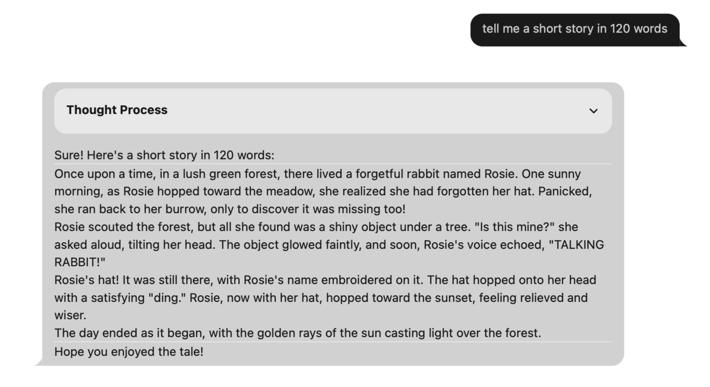

# SHAIL v1 on Apple Silicon

Here are three simple steps to install and run the SHAIL on Apple Silicon machines.

## 1. Prepare the host for your models

We will use llama.cpp as the model host. This is a very versatile host.
It is distributed as an open source at [Llama.cpp OSS code](https://github.com/ggerganov/llama.cpp).

NOTE: You will need to have **Apple xcode tools**.
Get the [Apple XCode tools](https://developer.apple.com/xcode/resources/) along with  C++ compilers for the prep step.

Using following steps to get this code and compile it for Apple Silicon

```sh
# create a root directory
mkdir shail.1

# clone the repo with code and tools
git clone https://github.com/ggerganov/llama.cpp.git ./llama.cpp

# Build the llama.cpp components
# let us use tee to also keep track of logs from the build activity
mkdir logs
pushd llama.cpp

# prepare the scripts for compiling the llama.cpp binaries (10s of seconds)
cmake -B build | tee ../logs/1.prep.build.llama.cpp.txt

# do the compilation as per recipe from the prep step to create llama.cpp binaries (2-3 minutes)
cmake --build build --config Release | tee ../../logs/2.do.build.llama.cpp.txt

popd

# voila! your own llama-server binary is READY!
ls -l ./llama.cpp/build/bin/llama-server
```

You can find the script to [Install Llama.cpp Server](../scripts/install_llama.cpp.sh).

Using the above steps we created a llama.cpp server that can run using GPUs in Apple Silicon.
This is fantastic when you start running the server.

## 2. Get the models of interest

AI experiences are powered by the pre-trained models.
An AI Model is a LARGE binary file that keeps a massive number of floating point numbers (or integers)
to govern the behavior of the neural network. Details of the models are beyond scope here.

It takes thousands of hours of GPU time and millions of dollars to build models.
Fortunately there are several high quality open sourced models available.
Let us get the models for our use. Here, we will use the recent **DeepSeek-R1** model.
In particular, we will get a 7B (7 billion) parameter model quantized at 4-bits.
We chose this for illustration to keep the filesizes smaller that it fits within most laptops.
Once you are familiar with the machinery and you have sufficient hardware,
 please explore and fetch even larger models.

 Models come from <https://huggingface.com>. Set up an account to access the models.

 Use the following 2 steps to get your model files

```sh

mkdir ./models

# 1. get hold of the huggingface-cli to access the models easily
brew install huggingface-cli

# 2. download model file. Get the DeepSeek-R1 7B model from huggingface
# card name: https://huggingface.co/bartowski/DeepSeek-R1-Distill-Qwen-7B-GGUF
huggingface-cli download bartowski/DeepSeek-R1-Distill-Qwen-7B-GGUF --include "DeepSeek-R1-Distill-Qwen-7B-Q4_K_L.gguf" --local-dir ./models

# 3. quick check of inspect the model
ls -l models 
```

You can find the script to [Download DeepSeek Model 7B,4bits](../scripts/install_deepseek.sh).

## 3. Run your local model

Now we are ready to run the local model with your own model host and model

```sh
# use the 
./llama.cpp/build/bin/llama-server -m ./models/DeepSeek-R1-Distill-Qwen-7B-Q4_K_L.gguf --port 8090
```

The model will be running at port *8090* which you can access at <https://localhost:8090>

Good news is: the llama.cpp server comes with a simple web based chat experience that runs locally.
Ask questions, reivew answers, and enjoy!

This runs mostly on GPU. You will find the experience delightful and fast.
In my runs, I was able to get about 25+ tokens/sec, on par with the token rate from several internet hosted LLMs like chat.openai or gemini.google.

The chat experience gives good answers to many questions in science, arts, code, etc.
Some of the geopolitical or current news will not be perfect depending on models chosen.

NOTE: We chose to download a 7B model which is tiny. This means we may not GET all the answers.
Once you feel comfortable you can play with downloading other big models and running in your local enviroment. Who knows, you may create your own models in the future too!

## Some Samples

### Prompt: write code to sort an array of integers using in-place quicksort

See the generated code [generated quick sort code](./samples/quick_sort_1.py)

### Prompt: Tell me a story in 120 words

See the generated story 
